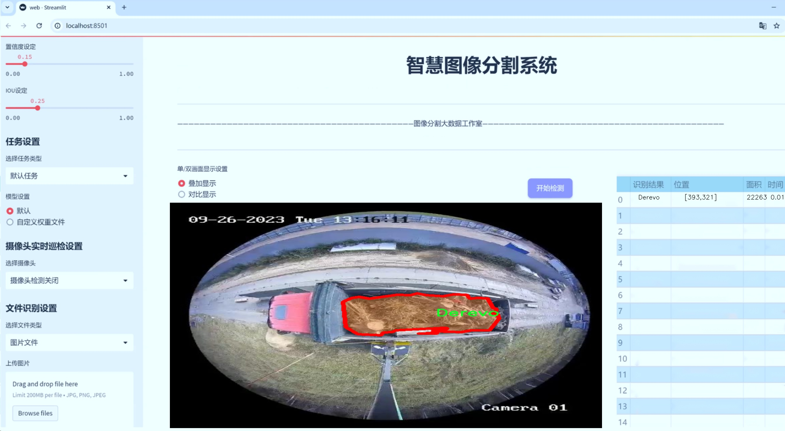
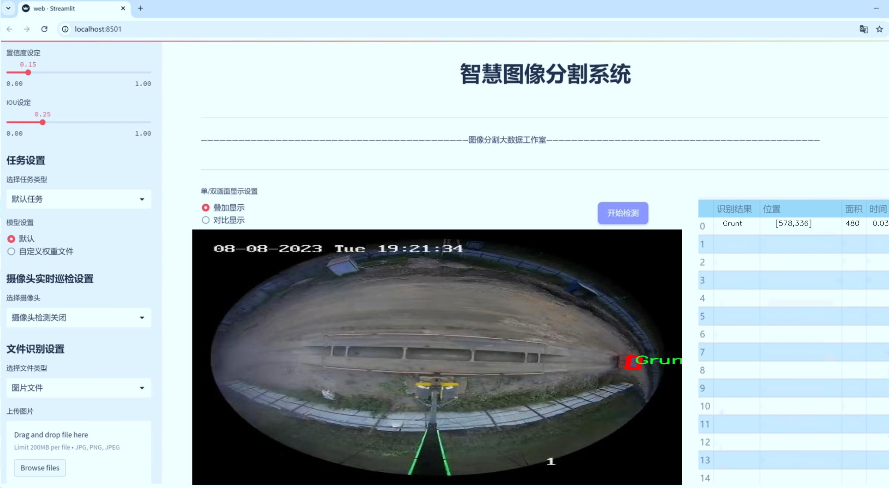
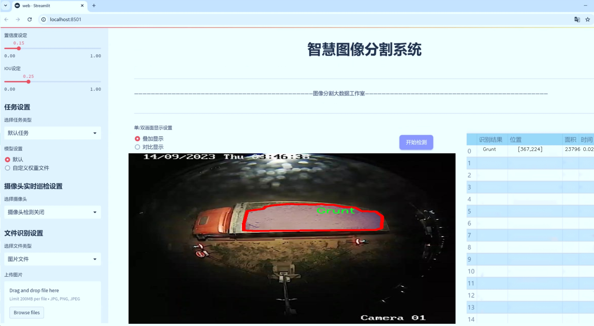
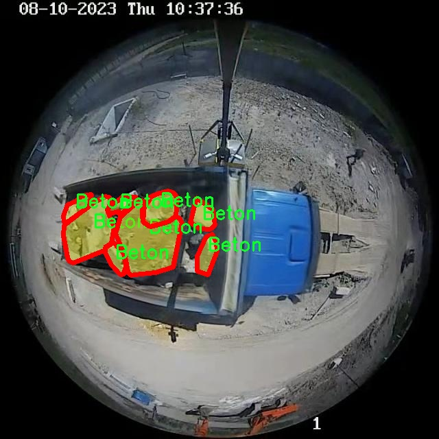
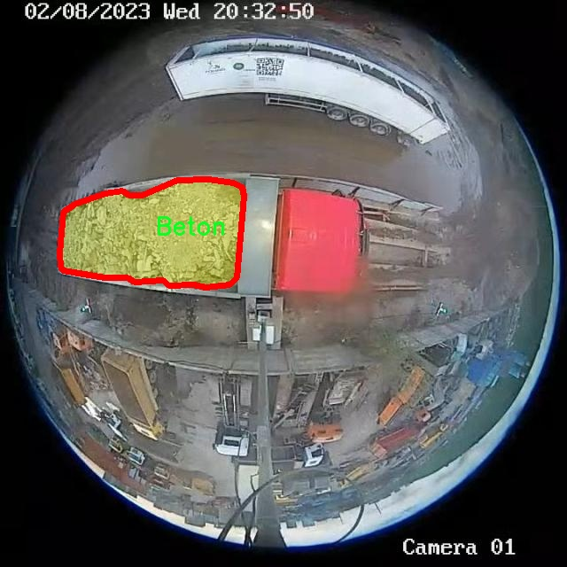
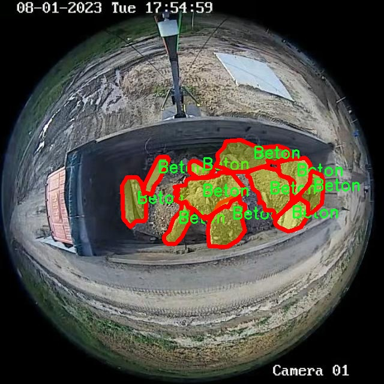
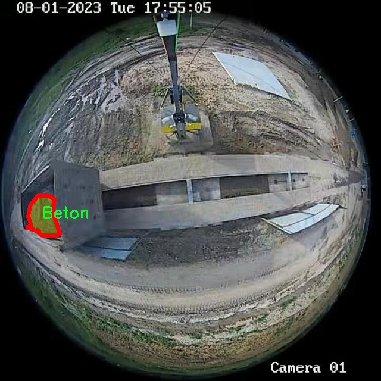
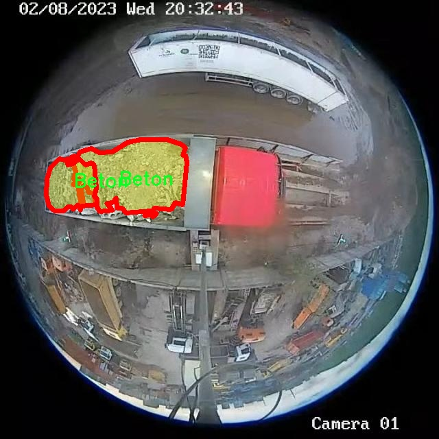

# 车载建筑材料分类分割系统源码＆数据集分享
 [yolov8-seg-bifpn＆yolov8-seg-C2f-SCcConv等50+全套改进创新点发刊_一键训练教程_Web前端展示]

### 1.研究背景与意义

项目参考[ILSVRC ImageNet Large Scale Visual Recognition Challenge](https://gitee.com/YOLOv8_YOLOv11_Segmentation_Studio/projects)

项目来源[AAAI Global Al lnnovation Contest](https://kdocs.cn/l/cszuIiCKVNis)

研究背景与意义

随着城市化进程的加快，建筑行业面临着日益增长的建筑材料管理需求。传统的建筑材料分类和分割方法往往依赖人工操作，不仅效率低下，而且容易受到人为因素的影响，导致分类错误和资源浪费。因此，开发一种高效、准确的自动化建筑材料分类分割系统显得尤为重要。近年来，深度学习技术的迅猛发展为解决这一问题提供了新的思路和方法，尤其是目标检测和实例分割领域的进步，使得计算机视觉在建筑材料识别中的应用成为可能。

YOLO（You Only Look Once）系列模型因其高效的实时检测能力而广受欢迎。YOLOv8作为该系列的最新版本，结合了多种先进的技术，如特征金字塔网络（FPN）和自注意力机制，显著提升了目标检测的精度和速度。然而，现有的YOLOv8模型在特定领域的应用，如车载建筑材料分类分割，仍存在一定的局限性。针对这一问题，基于改进YOLOv8的车载建筑材料分类分割系统的研究应运而生，旨在提升建筑材料的自动识别和分类能力。

本研究所使用的数据集包含3500张图像，涵盖了五类建筑材料：混凝土（Beton）、木材（Derevo）、土壤（Grunt）、砖块（Kirpich）以及其他（э）。这些类别的选择反映了建筑行业中常见的材料类型，具有较强的代表性和实用性。通过对这些材料的有效分类和分割，不仅可以提高建筑施工的效率，还能为建筑材料的采购、管理和回收提供数据支持，推动建筑行业的可持续发展。

在实际应用中，车载建筑材料分类分割系统能够通过搭载在车辆上的摄像头实时捕捉周围环境中的建筑材料信息，并利用改进的YOLOv8模型进行快速分析。这种系统的实施将大幅提升建筑材料的监测效率，减少人工检查的工作量，并降低由于材料识别错误而导致的经济损失。此外，系统还可以为建筑工地的安全管理提供数据支持，及时识别潜在的安全隐患。

综上所述，基于改进YOLOv8的车载建筑材料分类分割系统的研究不仅具有重要的理论意义，还具备广泛的实际应用价值。通过提高建筑材料的识别精度和处理速度，本研究将为建筑行业的智能化、自动化发展提供新的解决方案，推动建筑材料管理的现代化进程，最终实现资源的高效利用和环境的可持续发展。

### 2.图片演示







##### 注意：由于此博客编辑较早，上面“2.图片演示”和“3.视频演示”展示的系统图片或者视频可能为老版本，新版本在老版本的基础上升级如下：（实际效果以升级的新版本为准）

  （1）适配了YOLOV8的“目标检测”模型和“实例分割”模型，通过加载相应的权重（.pt）文件即可自适应加载模型。

  （2）支持“图片识别”、“视频识别”、“摄像头实时识别”三种识别模式。

  （3）支持“图片识别”、“视频识别”、“摄像头实时识别”三种识别结果保存导出，解决手动导出（容易卡顿出现爆内存）存在的问题，识别完自动保存结果并导出到tempDir中。

  （4）支持Web前端系统中的标题、背景图等自定义修改，后面提供修改教程。

  另外本项目提供训练的数据集和训练教程,暂不提供权重文件（best.pt）,需要您按照教程进行训练后实现图片演示和Web前端界面演示的效果。

### 3.视频演示

[3.1 视频演示](https://www.bilibili.com/video/BV1L52UYDEJ1/)

### 4.数据集信息展示

##### 4.1 本项目数据集详细数据（类别数＆类别名）

nc: 5
names: ['-', 'Beton', 'Derevo', 'Grunt', 'Kirpich']


##### 4.2 本项目数据集信息介绍

数据集信息展示

在本研究中，我们使用了名为“Hackaton 5”的数据集，以训练和改进YOLOv8-seg模型，旨在实现高效的车载建筑材料分类与分割系统。该数据集专门设计用于处理建筑材料的图像数据，包含了五个主要类别，分别是混凝土（Beton）、木材（Derevo）、土壤（Grunt）、砖块（Kirpich）以及一个未定义类别（-）。这种分类的设置为我们提供了丰富的训练样本，使得模型能够在多种建筑材料的检测与分割任务中表现出色。

“Hackaton 5”数据集的构建考虑到了现实世界中建筑材料的多样性和复杂性。每个类别的样本都经过精心挑选和标注，确保了数据的高质量和代表性。混凝土（Beton）作为现代建筑中最常用的材料之一，其图像样本涵盖了不同的混凝土类型和状态，包括新浇筑的混凝土、老化的混凝土以及各种表面处理的混凝土。这些样本的多样性使得模型能够更好地适应不同环境下的混凝土识别。

木材（Derevo）类别则包含了多种类型的木材样本，包括原木、加工木材以及不同处理工艺的木材。这一类别的样本不仅有助于模型识别不同种类的木材，还能帮助其理解木材在不同光照和背景下的外观变化。土壤（Grunt）类别的样本则包括了不同类型的土壤，如沙土、黏土和壤土，模型通过这些样本学习到土壤的颜色、纹理及其在自然环境中的变化。

砖块（Kirpich）类别同样具有重要意义，样本中包含了不同颜色、形状和尺寸的砖块，这些特征的多样性为模型提供了丰富的学习材料，使其能够在实际应用中准确识别和分割砖块。在这五个类别中，未定义类别（-）的存在则为模型提供了额外的灵活性，允许其在遇到不明确或未标注的材料时，能够进行适当的处理和判断。

为了确保模型的训练效果，数据集中的每个类别都包含了大量的标注图像，这些图像经过了精细的分割和标注，确保了每个建筑材料的边界清晰可辨。这种高质量的标注不仅提高了模型的训练效率，也为后续的模型评估和优化提供了坚实的基础。

综上所述，“Hackaton 5”数据集为我们提供了一个多样化且高质量的训练平台，使得YOLOv8-seg模型能够在车载建筑材料分类与分割任务中表现出色。通过对这五个类别的深入学习，模型将能够在实际应用中实现高效、准确的建筑材料识别与分割，为建筑行业的智能化发展提供有力支持。











### 5.全套项目环境部署视频教程（零基础手把手教学）

[5.1 环境部署教程链接（零基础手把手教学）](https://www.bilibili.com/video/BV1jG4Ve4E9t/?vd_source=bc9aec86d164b67a7004b996143742dc)


[5.2 安装Python虚拟环境创建和依赖库安装视频教程链接（零基础手把手教学）](https://www.bilibili.com/video/BV1nA4VeYEze/?vd_source=bc9aec86d164b67a7004b996143742dc)

### 6.手把手YOLOV8-seg训练视频教程（零基础小白有手就能学会）

[6.1 手把手YOLOV8-seg训练视频教程（零基础小白有手就能学会）](https://www.bilibili.com/video/BV1cA4VeYETe/?vd_source=bc9aec86d164b67a7004b996143742dc)


按照上面的训练视频教程链接加载项目提供的数据集，运行train.py即可开始训练



     Epoch   gpu_mem       box       obj       cls    labels  img_size
     1/200     0G   0.01576   0.01955  0.007536        22      1280: 100%|██████████| 849/849 [14:42<00:00,  1.04s/it]
               Class     Images     Labels          P          R     mAP@.5 mAP@.5:.95: 100%|██████████| 213/213 [01:14<00:00,  2.87it/s]
                 all       3395      17314      0.994      0.957      0.0957      0.0843

     Epoch   gpu_mem       box       obj       cls    labels  img_size
     2/200     0G   0.01578   0.01923  0.007006        22      1280: 100%|██████████| 849/849 [14:44<00:00,  1.04s/it]
               Class     Images     Labels          P          R     mAP@.5 mAP@.5:.95: 100%|██████████| 213/213 [01:12<00:00,  2.95it/s]
                 all       3395      17314      0.996      0.956      0.0957      0.0845

     Epoch   gpu_mem       box       obj       cls    labels  img_size
     3/200     0G   0.01561    0.0191  0.006895        27      1280: 100%|██████████| 849/849 [10:56<00:00,  1.29it/s]
               Class     Images     Labels          P          R     mAP@.5 mAP@.5:.95: 100%|███████   | 187/213 [00:52<00:00,  4.04it/s]
                 all       3395      17314      0.996      0.957      0.0957      0.0845


### 7.50+种全套YOLOV8-seg创新点代码加载调参视频教程（一键加载写好的改进模型的配置文件）

[7.1 50+种全套YOLOV8-seg创新点代码加载调参视频教程（一键加载写好的改进模型的配置文件）](https://www.bilibili.com/video/BV1Hw4VePEXv/?vd_source=bc9aec86d164b67a7004b996143742dc)

### 8.YOLOV8-seg图像分割算法原理

原始YOLOV8-seg算法原理

YOLOv8-seg算法是YOLO系列模型中的最新版本，代表了目标检测和实例分割领域的重大进步。该算法在设计上采用了anchor-free的方法，这一创新使得YOLOv8在检测精度和速度上均有显著提升。与传统的anchor-based检测方法相比，YOLOv8通过直接预测目标的位置和类别，简化了检测过程，降低了计算复杂度，同时提高了对小目标的检测能力。然而，在复杂的水面环境中，YOLOv8-seg仍面临着一些挑战，尤其是在小目标漂浮物的检测上，由于其特征复杂且背景多样，导致了定位误差和目标感知能力不足的问题。

YOLOv8-seg的网络结构主要由四个模块组成：输入端、主干网络、Neck端和输出端。输入端通过Mosaic数据增强、自适应图片缩放和灰度填充等技术对输入图像进行预处理，以增强模型的鲁棒性。主干网络则负责特征提取，采用了卷积、池化等操作，利用C2f模块和SPPF结构提取多层次的特征信息。C2f模块的设计灵感源于跨阶段局部网络（CSP），通过增加跳层连接和Split操作，有效地增强了特征提取的能力，使得网络能够更好地捕捉到细粒度的上下文信息。

在Neck端，YOLOv8-seg引入了路径聚合网络（PAN）结构，通过上采样和下采样的方式对不同尺度的特征图进行融合。这一设计使得模型能够更好地处理多尺度目标，尤其是在复杂背景下的小目标检测。输出端则采用了解耦头结构，将分类和回归过程分开进行，从而提高了模型的灵活性和准确性。YOLOv8-seg在正负样本匹配时，采用了Task-Aligned Assigner方法，通过对分类分数和回归分数的加权，优化了样本匹配的效果。

为了进一步提升YOLOv8-seg在复杂环境下的表现，研究者们提出了YOLOv8-WSSOD算法的改进方案。该方案首先引入了BiFormer双层路由注意力机制，以减轻主干网络下采样过程中的噪声影响。通过捕获远程依赖，BiFormer能够保留更多细粒度的上下文信息，从而提高特征提取的精度。此外，为了解决小目标漏检的问题，YOLOv8-WSSOD在网络中添加了一个更小的检测头，以增强对小目标的感知能力。

在Neck端，YOLOv8-WSSOD引入了GSConv和Slim-neck技术，这不仅保持了模型的检测精度，还有效降低了计算量，使得模型在处理复杂场景时依然能够保持高效的运行速度。最后，YOLOv8-WSSOD还使用了MPDIoU损失函数替换了CIoU损失函数，以提高模型的泛化能力和精准度。MPDIoU损失函数通过考虑目标的重叠度和相对位置，能够更好地优化目标检测的效果，尤其是在复杂背景下的小目标检测中。

综上所述，YOLOv8-seg算法通过一系列创新的设计和改进，极大地提升了目标检测和实例分割的性能。其anchor-free的检测方法、灵活的网络结构以及对小目标的增强感知能力，使得YOLOv8-seg在实际应用中展现出强大的潜力。尽管在复杂水面环境下仍存在一些挑战，但通过不断的研究和改进，YOLOv8-seg无疑将成为未来目标检测领域的重要工具，为相关应用提供更加精准和高效的解决方案。


### 9.系统功能展示（检测对象为举例，实际内容以本项目数据集为准）

图9.1.系统支持检测结果表格显示

  图9.2.系统支持置信度和IOU阈值手动调节

  图9.3.系统支持自定义加载权重文件best.pt(需要你通过步骤5中训练获得)

  图9.4.系统支持摄像头实时识别

  图9.5.系统支持图片识别

  图9.6.系统支持视频识别

  图9.7.系统支持识别结果文件自动保存

  图9.8.系统支持Excel导出检测结果数据


### 10.50+种全套YOLOV8-seg创新点原理讲解（非科班也可以轻松写刊发刊，V11版本正在科研待更新）

#### 10.1 由于篇幅限制，每个创新点的具体原理讲解就不一一展开，具体见下列网址中的创新点对应子项目的技术原理博客网址【Blog】：


[10.1 50+种全套YOLOV8-seg创新点原理讲解链接](https://gitee.com/qunmasj/good)

#### 10.2 部分改进模块原理讲解(完整的改进原理见上图和技术博客链接)【如果此小节的图加载失败可以通过CSDN或者Github搜索该博客的标题访问原始博客，原始博客图片显示正常】
### YOLOv8简介
#### Neck模块设计
骨干网络和 Neck 的具体变化为：

第一个卷积层的 kernel 从 6x6 变成了 3x3
所有的 C3 模块换成 C2f，结构如下所示，可以发现多了更多的跳层连接和额外的 Split 操作


去掉了 Neck 模块中的 2 个卷积连接层
Backbone 中 C2f 的 block 数从 3-6-9-3 改成了 3-6-6-3
查看 N/S/M/L/X 等不同大小模型，可以发现 N/S 和 L/X 两组模型只是改了缩放系数，但是 S/M/L 等骨干网络的通道数设置不一样，没有遵循同一套缩放系数。如此设计的原因应该是同一套缩放系数下的通道设置不是最优设计，YOLOv7 网络设计时也没有遵循一套缩放系数作用于所有模型。

#### Head模块设计
Head 部分变化最大，从原先的耦合头变成了解耦头，并且从 YOLOv5 的 Anchor-Based 变成了 Anchor-Free。其结构如下所示：


可以看出，不再有之前的 objectness 分支，只有解耦的分类和回归分支，并且其回归分支使用了 Distribution Focal Loss 中提出的积分形式表示法。

#### Loss 计算
Loss 计算过程包括 2 个部分： 正负样本分配策略和 Loss 计算。 现代目标检测器大部分都会在正负样本分配策略上面做文章，典型的如 YOLOX 的 simOTA、TOOD 的 TaskAlignedAssigner 和 RTMDet 的 DynamicSoftLabelAssigner，这类 Assigner 大都是动态分配策略，而 YOLOv5 采用的依然是静态分配策略。考虑到动态分配策略的优异性，YOLOv8 算法中则直接引用了 TOOD 的 TaskAlignedAssigner。 TaskAlignedAssigner 的匹配策略简单总结为： 根据分类与回归的分数加权的分数选择正样本。

s 是标注类别对应的预测分值，u 是预测框和 gt 框的 iou，两者相乘就可以衡量对齐程度。

对于每一个 GT，对所有的预测框基于 GT 类别对应分类分数，预测框与 GT 的 IoU 的加权得到一个关联分类以及回归的对齐分数 alignment_metrics 。
对于每一个 GT，直接基于 alignment_metrics 对齐分数选取 topK 大的作为正样本
Loss 计算包括 2 个分支： 分类和回归分支，没有了之前的 objectness 分支。
分类分支依然采用 BCE Loss
回归分支需要和 Distribution Focal Loss 中提出的积分形式表示法绑定，因此使用了 Distribution Focal Loss， 同时还使用了 CIoU Loss
Loss 采用一定权重比例加权即可。
#### 训练数据增强
数据增强方面和 YOLOv5 差距不大，只不过引入了 YOLOX 中提出的最后 10 个 epoch 关闭 Mosaic 的操作。假设训练 epoch 是 500，其示意图如下所示：

### RCS-OSA的基本原理
参考该博客，RCSOSA（RCS-One-Shot Aggregation）是RCS-YOLO中提出的一种结构，我们可以将主要原理概括如下：

1. RCS（Reparameterized Convolution based on channel Shuffle）: 结合了通道混洗，通过重参数化卷积来增强网络的特征提取能力。

2. RCS模块: 在训练阶段，利用多分支结构学习丰富的特征表示；在推理阶段，通过结构化重参数化简化为单一分支，减少内存消耗。

3. OSA（One-Shot Aggregation）: 一次性聚合多个特征级联，减少网络计算负担，提高计算效率。

4. 特征级联: RCS-OSA模块通过堆叠RCS，确保特征的复用并加强不同层之间的信息流动。

#### RCS
RCS（基于通道Shuffle的重参数化卷积）是RCS-YOLO的核心组成部分，旨在训练阶段通过多分支结构学习丰富的特征信息，并在推理阶段通过简化为单分支结构来减少内存消耗，实现快速推理。此外，RCS利用通道分割和通道Shuffle操作来降低计算复杂性，同时保持通道间的信息交换，这样在推理阶段相比普通的3×3卷积可以减少一半的计算复杂度。通过结构重参数化，RCS能够在训练阶段从输入特征中学习深层表示，并在推理阶段实现快速推理，同时减少内存消耗。

#### RCS模块
RCS（基于通道Shuffle的重参数化卷积）模块中，结构在训练阶段使用多个分支，包括1x1和3x3的卷积，以及一个直接的连接（Identity），用于学习丰富的特征表示。在推理阶段，结构被重参数化成一个单一的3x3卷积，以减少计算复杂性和内存消耗，同时保持训练阶段学到的特征表达能力。这与RCS的设计理念紧密相连，即在不牺牲性能的情况下提高计算效率。


上图为大家展示了RCS的结构，分为训练阶段（a部分）和推理阶段（b部分）。在训练阶段，输入通过通道分割，一部分输入经过RepVGG块，另一部分保持不变。然后通过1x1卷积和3x3卷积处理RepVGG块的输出，与另一部分输入进行通道Shuffle和连接。在推理阶段，原来的多分支结构被简化为一个单一的3x3 RepConv块。这种设计允许在训练时学习复杂特征，在推理时减少计算复杂度。黑色边框的矩形代表特定的模块操作，渐变色的矩形代表张量的特定特征，矩形的宽度代表张量的通道数。 

#### OSA
OSA（One-Shot Aggregation）是一个关键的模块，旨在提高网络在处理密集连接时的效率。OSA模块通过表示具有多个感受野的多样化特征，并在最后的特征映射中仅聚合一次所有特征，从而克服了DenseNet中密集连接的低效率问题。

OSA模块的使用有两个主要目的：

1. 提高特征表示的多样性：OSA通过聚合具有不同感受野的特征来增加网络对于不同尺度的敏感性，这有助于提升模型对不同大小目标的检测能力。

2. 提高效率：通过在网络的最后一部分只进行一次特征聚合，OSA减少了重复的特征计算和存储需求，从而提高了网络的计算和能源效率。

在RCS-YOLO中，OSA模块被进一步与RCS（基于通道Shuffle的重参数化卷积）相结合，形成RCS-OSA模块。这种结合不仅保持了低成本的内存消耗，而且还实现了语义信息的有效提取，对于构建轻量级和大规模的对象检测器尤为重要。

下面我将为大家展示RCS-OSA（One-Shot Aggregation of RCS）的结构。


在RCS-OSA模块中，输入被分为两部分，一部分直接通过，另一部分通过堆叠的RCS模块进行处理。处理后的特征和直接通过的特征在通道混洗（Channel Shuffle）后合并。这种结构设计用于增强模型的特征提取和利用效率，是RCS-YOLO架构中的一个关键组成部分旨在通过一次性聚合来提高模型处理特征的能力，同时保持计算效率。

#### 特征级联
特征级联（feature cascade）是一种技术，通过在网络的一次性聚合（one-shot aggregate）路径上维持有限数量的特征级联来实现的。在RCS-YOLO中，特别是在RCS-OSA（RCS-Based One-Shot Aggregation）模块中，只保留了三个特征级联。

特征级联的目的是为了减轻网络计算负担并降低内存占用。这种方法可以有效地聚合不同层次的特征，提高模型的语义信息提取能力，同时避免了过度复杂化网络结构所带来的低效率和高资源消耗。

下面为大家提供的图像展示的是RCS-YOLO的整体架构，其中包括RCS-OSA模块。RCS-OSA在模型中用于堆叠RCS模块，以确保特征的复用并加强不同层之间的信息流动。图中显示的多层RCS-OSA模块的排列和组合反映了它们如何一起工作以优化特征传递和提高检测性能。


总结：RCS-YOLO主要由RCS-OSA（蓝色模块）和RepVGG（橙色模块）构成。这里的n代表堆叠RCS模块的数量。n_cls代表检测到的对象中的类别数量。图中的IDetect是从YOLOv7中借鉴过来的，表示使用二维卷积神经网络的检测层。这个架构通过堆叠的RCS模块和RepVGG模块，以及两种类型的检测层，实现了对象检测的任务。 


### 11.项目核心源码讲解（再也不用担心看不懂代码逻辑）

#### 11.1 ultralytics\nn\extra_modules\orepa.py

以下是对代码中最核心部分的分析和详细中文注释。代码的主要功能是实现一种高效的卷积神经网络模块，使用了可重参数化的卷积（RepVGG）和一些其他技术。

```python
import torch
import torch.nn as nn
import torch.nn.init as init
import torch.nn.functional as F
import numpy as np

# 定义核心模块 OREPA
class OREPA(nn.Module):
    def __init__(self, in_channels, out_channels, kernel_size=3, stride=1, padding=None, groups=1, dilation=1, act=True):
        super(OREPA, self).__init__()
        
        # 初始化参数
        self.kernel_size = kernel_size
        self.in_channels = in_channels
        self.out_channels = out_channels
        self.groups = groups
        self.stride = stride
        self.padding = padding if padding is not None else (kernel_size // 2)
        self.dilation = dilation
        
        # 激活函数
        self.nonlinear = nn.ReLU() if act else nn.Identity()
        
        # 权重参数初始化
        self.weight_orepa_origin = nn.Parameter(torch.Tensor(out_channels, in_channels // groups, kernel_size, kernel_size))
        init.kaiming_uniform_(self.weight_orepa_origin, a=math.sqrt(0.0))
        
        # 其他权重参数
        self.weight_orepa_avg_conv = nn.Parameter(torch.Tensor(out_channels, in_channels // groups, 1, 1))
        init.kaiming_uniform_(self.weight_orepa_avg_conv, a=0.0)
        
        self.vector = nn.Parameter(torch.Tensor(6, out_channels))  # 权重组合向量
        self.bn = nn.BatchNorm2d(out_channels)  # 批归一化层

    def weight_gen(self):
        # 生成最终的卷积权重
        weight_orepa_origin = self.weight_orepa_origin * self.vector[0, :].view(-1, 1, 1, 1)
        weight_orepa_avg = self.weight_orepa_avg_conv * self.vector[1, :].view(-1, 1, 1, 1)
        
        # 合并权重
        weight = weight_orepa_origin + weight_orepa_avg
        return weight

    def forward(self, inputs):
        # 前向传播
        weight = self.weight_gen()  # 生成权重
        out = F.conv2d(inputs, weight, stride=self.stride, padding=self.padding, dilation=self.dilation, groups=self.groups)
        return self.nonlinear(self.bn(out))  # 激活和归一化

# 定义大型卷积模块 OREPA_LargeConv
class OREPA_LargeConv(nn.Module):
    def __init__(self, in_channels, out_channels, kernel_size=1, stride=1, padding=None, groups=1, dilation=1, act=True):
        super(OREPA_LargeConv, self).__init__()
        
        # 初始化参数
        self.kernel_size = kernel_size
        self.in_channels = in_channels
        self.out_channels = out_channels
        self.stride = stride
        self.padding = padding if padding is not None else (kernel_size // 2)
        self.groups = groups
        
        # 激活函数
        self.nonlinear = nn.ReLU() if act else nn.Identity()
        
        # 创建多个 OREPA 模块
        self.layers = int((kernel_size - 1) / 2)
        for i in range(self.layers):
            if i == 0:
                self.add_module(f'weight{i}', OREPA(in_channels, out_channels, kernel_size=3, stride=1, padding=1, groups=groups))
            elif i == self.layers - 1:
                self.add_module(f'weight{i}', OREPA(out_channels, out_channels, kernel_size=3, stride=stride, padding=1, groups=groups))
            else:
                self.add_module(f'weight{i}', OREPA(out_channels, out_channels, kernel_size=3, stride=1, padding=1, groups=groups))

    def forward(self, inputs):
        # 前向传播
        weight = self.weight_gen()  # 生成权重
        out = F.conv2d(inputs, weight, stride=self.stride, padding=self.padding, dilation=self.dilation, groups=self.groups)
        return self.nonlinear(out)  # 激活

# 定义卷积与批归一化结合的模块 ConvBN
class ConvBN(nn.Module):
    def __init__(self, in_channels, out_channels, kernel_size, stride=1, padding=0, dilation=1, groups=1):
        super().__init__()
        
        # 创建卷积层
        self.conv = nn.Conv2d(in_channels, out_channels, kernel_size, stride=stride, padding=padding, dilation=dilation, groups=groups, bias=False)
        self.bn = nn.BatchNorm2d(out_channels)  # 批归一化层

    def forward(self, x):
        # 前向传播
        return self.bn(self.conv(x))  # 先卷积后归一化

# 定义 RepVGGBlock_OREPA 模块
class RepVGGBlock_OREPA(nn.Module):
    def __init__(self, in_channels, out_channels, kernel_size=3, stride=1, padding=None, groups=1, act=True):
        super(RepVGGBlock_OREPA, self).__init__()
        
        # 初始化参数
        self.in_channels = in_channels
        self.out_channels = out_channels
        self.groups = groups
        self.padding = padding if padding is not None else (kernel_size // 2)
        
        # 激活函数
        self.nonlinearity = nn.ReLU() if act else nn.Identity()
        
        # 创建 OREPA 模块
        self.rbr_dense = OREPA(in_channels, out_channels, kernel_size=kernel_size, stride=stride, padding=self.padding, groups=groups)

    def forward(self, inputs):
        # 前向传播
        out = self.rbr_dense(inputs)  # 通过 OREPA 模块
        return self.nonlinearity(out)  # 激活

```

### 代码核心部分说明：
1. **OREPA模块**：实现了一个可重参数化的卷积模块，支持多种卷积方式的组合。通过`weight_gen`方法生成最终的卷积权重。
2. **OREPA_LargeConv模块**：通过多个OREPA模块构建更大的卷积层，适用于更复杂的网络结构。
3. **ConvBN模块**：将卷积层和批归一化结合在一起，简化了模型的构建。
4. **RepVGGBlock_OREPA模块**：实现了一个包含OREPA模块的网络块，适用于RepVGG架构。

### 总结：
这些模块通过组合不同的卷积方式和批归一化，提供了一种灵活且高效的卷积神经网络构建方式，适用于各种计算机视觉任务。

该文件定义了一个名为 `OREPA` 的深度学习模块，主要用于构建卷积神经网络中的特定卷积层。该模块通过一系列的参数和操作来实现高效的卷积计算，并且支持在训练和推理阶段的不同配置。

首先，文件导入了必要的库，包括 PyTorch 和 NumPy，并定义了一些辅助函数，例如 `transI_fusebn` 和 `transVI_multiscale`，用于处理卷积核和批归一化的转换，以及对卷积核进行多尺度填充。

`OREPA` 类的构造函数接受多个参数，包括输入和输出通道数、卷积核大小、步幅、填充、分组卷积等。根据 `deploy` 参数的值，模块可以在训练模式和推理模式之间切换。在训练模式下，模块会初始化多个卷积核的权重，并通过 Kaiming 初始化方法进行初始化。权重包括原始卷积核、平均卷积核、1x1 卷积核等，此外，还定义了一个向量 `vector` 用于组合不同卷积核的权重。

`weight_gen` 方法用于生成最终的卷积权重，通过对不同权重进行加权组合，形成最终的卷积核。`forward` 方法定义了前向传播的过程，根据是否在推理模式下，选择使用重参数化的卷积层或计算生成的权重进行卷积操作。

`OREPA_LargeConv` 类是一个大卷积层的实现，使用了多个 `OREPA` 模块来构建更大的卷积操作。`ConvBN` 类则是一个简单的卷积层加批归一化的组合，提供了方便的前向传播和权重融合功能。

`OREPA_3x3_RepVGG` 和 `RepVGGBlock_OREPA` 类则是更复杂的结构，结合了 `OREPA` 和其他卷积层，支持在不同阶段的操作，并且提供了用于模型量化和优化的功能。

总的来说，该文件实现了一种灵活且高效的卷积模块，能够在训练和推理阶段之间切换，并通过重参数化技术优化卷积操作，适用于深度学习中的多种应用场景。

#### 11.2 ultralytics\models\yolo\segment\train.py

以下是经过简化和注释的核心代码部分：

```python
# 导入必要的库和模块
from copy import copy
from ultralytics.models import yolo
from ultralytics.nn.tasks import SegmentationModel
from ultralytics.utils import DEFAULT_CFG, RANK
from ultralytics.utils.plotting import plot_images, plot_results

class SegmentationTrainer(yolo.detect.DetectionTrainer):
    """
    扩展自DetectionTrainer类，用于基于分割模型的训练。
    示例用法：
        ```python
        from ultralytics.models.yolo.segment import SegmentationTrainer

        args = dict(model='yolov8n-seg.pt', data='coco8-seg.yaml', epochs=3)
        trainer = SegmentationTrainer(overrides=args)
        trainer.train()
        ```
    """

    def __init__(self, cfg=DEFAULT_CFG, overrides=None, _callbacks=None):
        """初始化SegmentationTrainer对象，接受配置和重写参数。"""
        if overrides is None:
            overrides = {}
        overrides['task'] = 'segment'  # 设置任务类型为分割
        super().__init__(cfg, overrides, _callbacks)  # 调用父类构造函数

    def get_model(self, cfg=None, weights=None, verbose=True):
        """返回初始化的SegmentationModel，使用指定的配置和权重。"""
        # 创建分割模型实例
        model = SegmentationModel(cfg, ch=3, nc=self.data['nc'], verbose=verbose and RANK == -1)
        if weights:
            model.load(weights)  # 如果提供了权重，则加载权重

        return model  # 返回模型实例

    def get_validator(self):
        """返回SegmentationValidator实例，用于YOLO模型的验证。"""
        self.loss_names = 'box_loss', 'seg_loss', 'cls_loss', 'dfl_loss'  # 定义损失名称
        # 创建并返回分割验证器实例
        return yolo.segment.SegmentationValidator(self.test_loader, save_dir=self.save_dir, args=copy(self.args))

    def plot_training_samples(self, batch, ni):
        """创建训练样本图像的绘图，包括标签和框坐标。"""
        plot_images(batch['img'],  # 图像数据
                    batch['batch_idx'],  # 批次索引
                    batch['cls'].squeeze(-1),  # 类别
                    batch['bboxes'],  # 边界框
                    batch['masks'],  # 掩码
                    paths=batch['im_file'],  # 图像文件路径
                    fname=self.save_dir / f'train_batch{ni}.jpg',  # 保存路径
                    on_plot=self.on_plot)  # 绘图回调

    def plot_metrics(self):
        """绘制训练和验证指标。"""
        plot_results(file=self.csv, segment=True, on_plot=self.on_plot)  # 保存结果图像
```

### 代码注释说明：
1. **导入模块**：引入所需的库和模块，包括YOLO模型、分割模型、默认配置和绘图工具。
2. **SegmentationTrainer类**：继承自DetectionTrainer，用于处理分割任务的训练。
3. **构造函数**：初始化时设置任务类型为分割，并调用父类的构造函数。
4. **get_model方法**：创建并返回一个分割模型实例，可以选择加载预训练权重。
5. **get_validator方法**：返回一个分割验证器实例，用于评估模型性能。
6. **plot_training_samples方法**：生成并保存训练样本的可视化图像，展示图像、类别、边界框和掩码。
7. **plot_metrics方法**：绘制训练和验证过程中的指标，便于监控模型性能。

这个程序文件是一个用于训练YOLO（You Only Look Once）模型进行图像分割的类，名为`SegmentationTrainer`，它继承自`DetectionTrainer`类。该类主要负责设置和执行图像分割任务的训练过程。

在文件的开头，导入了一些必要的模块和类，包括YOLO模型、分割模型、默认配置、排名以及用于绘图的工具。接着，定义了`SegmentationTrainer`类，并在类文档字符串中提供了使用示例，说明如何实例化该类并调用`train`方法进行训练。

构造函数`__init__`接受配置参数`cfg`、覆盖参数`overrides`和回调参数`_callbacks`。如果没有提供覆盖参数，则初始化为空字典。接着，将任务类型设置为“segment”，并调用父类的构造函数进行初始化。

`get_model`方法用于返回一个初始化的分割模型`SegmentationModel`，该模型根据提供的配置和权重进行设置。如果指定了权重，模型会加载这些权重。

`get_validator`方法返回一个分割验证器`SegmentationValidator`的实例，用于对YOLO模型进行验证。在此方法中，还定义了损失名称，包括框损失、分割损失、分类损失和分布损失。

`plot_training_samples`方法用于创建一个训练样本图像的绘图，包含标签和框坐标。它接受一个批次的样本和一个索引，并生成相应的图像文件。

最后，`plot_metrics`方法用于绘制训练和验证过程中的指标，调用`plot_results`函数来生成结果图像并保存。

整体来看，这个文件实现了YOLO模型在图像分割任务中的训练过程，提供了模型初始化、验证、绘图等功能，方便用户进行模型训练和结果分析。

#### 11.3 ui.py

以下是保留的核心代码部分，并添加了详细的中文注释：

```python
import sys
import subprocess

def run_script(script_path):
    """
    使用当前 Python 环境运行指定的脚本。

    Args:
        script_path (str): 要运行的脚本路径

    Returns:
        None
    """
    # 获取当前 Python 解释器的路径
    python_path = sys.executable

    # 构建运行命令，使用 streamlit 运行指定的脚本
    command = f'"{python_path}" -m streamlit run "{script_path}"'

    # 执行命令
    result = subprocess.run(command, shell=True)
    # 检查命令执行结果，如果返回码不为0，则表示执行出错
    if result.returncode != 0:
        print("脚本运行出错。")

# 实例化并运行应用
if __name__ == "__main__":
    # 指定要运行的脚本路径
    script_path = "web.py"  # 这里可以替换为实际的脚本路径

    # 调用函数运行指定的脚本
    run_script(script_path)
```

### 代码注释说明：
1. **导入模块**：
   - `sys`：用于访问与 Python 解释器相关的变量和函数。
   - `subprocess`：用于创建新进程、连接到它们的输入/输出/错误管道，并获得它们的返回码。

2. **`run_script` 函数**：
   - 该函数接受一个脚本路径作为参数，并使用当前 Python 环境来运行该脚本。
   - `sys.executable` 获取当前 Python 解释器的路径。
   - 使用 `subprocess.run` 执行构建的命令，并检查返回码以确定脚本是否成功运行。

3. **主程序块**：
   - 当脚本作为主程序运行时，指定要运行的脚本路径（`web.py`）。
   - 调用 `run_script` 函数来执行指定的脚本。

这个程序文件名为 `ui.py`，主要功能是通过当前的 Python 环境来运行一个指定的脚本。程序首先导入了必要的模块，包括 `sys`、`os` 和 `subprocess`，以及一个自定义的模块 `QtFusion.path` 中的 `abs_path` 函数。

在程序中定义了一个名为 `run_script` 的函数，该函数接受一个参数 `script_path`，表示要运行的脚本的路径。函数内部首先获取当前 Python 解释器的路径，并将其存储在 `python_path` 变量中。接着，构建一个命令字符串 `command`，这个命令用于通过 `streamlit` 运行指定的脚本。具体来说，命令的格式是 `python -m streamlit run "script_path"`，其中 `script_path` 是传入的脚本路径。

随后，使用 `subprocess.run` 方法执行这个命令。该方法的 `shell=True` 参数允许在 shell 中执行命令。执行后，程序检查命令的返回码，如果返回码不为 0，表示脚本运行过程中出现了错误，程序会打印出“脚本运行出错。”的提示信息。

在文件的最后部分，使用 `if __name__ == "__main__":` 语句来确保只有在直接运行该脚本时才会执行以下代码。这里指定了要运行的脚本路径，调用 `abs_path` 函数获取 `web.py` 的绝对路径，并将其传递给 `run_script` 函数以启动脚本的运行。

总的来说，这个程序的主要目的是通过指定的 Python 环境来运行一个名为 `web.py` 的脚本，并处理可能出现的错误。

#### 11.4 ultralytics\trackers\basetrack.py

以下是代码中最核心的部分，并附上详细的中文注释：

```python
from collections import OrderedDict
import numpy as np

class TrackState:
    """跟踪状态的枚举类，表示可能的物体跟踪状态。"""
    New = 0      # 新建状态
    Tracked = 1  # 正在跟踪状态
    Lost = 2     # 丢失状态
    Removed = 3  # 已移除状态

class BaseTrack:
    """物体跟踪的基类，处理基本的跟踪属性和操作。"""

    _count = 0  # 全局跟踪ID计数器

    track_id = 0  # 当前跟踪的ID
    is_activated = False  # 跟踪是否被激活
    state = TrackState.New  # 跟踪的初始状态

    history = OrderedDict()  # 跟踪历史记录
    features = []  # 特征列表
    curr_feature = None  # 当前特征
    score = 0  # 跟踪得分
    start_frame = 0  # 跟踪开始的帧数
    frame_id = 0  # 当前帧数
    time_since_update = 0  # 自上次更新以来的时间

    # 多摄像头位置
    location = (np.inf, np.inf)  # 初始化位置为无穷大

    @property
    def end_frame(self):
        """返回跟踪的最后帧ID。"""
        return self.frame_id

    @staticmethod
    def next_id():
        """递增并返回全局跟踪ID计数器。"""
        BaseTrack._count += 1
        return BaseTrack._count

    def activate(self, *args):
        """激活跟踪，使用提供的参数。"""
        raise NotImplementedError  # 需要在子类中实现

    def predict(self):
        """预测跟踪的下一个状态。"""
        raise NotImplementedError  # 需要在子类中实现

    def update(self, *args, **kwargs):
        """使用新的观测数据更新跟踪。"""
        raise NotImplementedError  # 需要在子类中实现

    def mark_lost(self):
        """将跟踪标记为丢失。"""
        self.state = TrackState.Lost

    def mark_removed(self):
        """将跟踪标记为已移除。"""
        self.state = TrackState.Removed

    @staticmethod
    def reset_id():
        """重置全局跟踪ID计数器。"""
        BaseTrack._count = 0
```

### 代码核心部分说明：
1. **TrackState 类**：定义了跟踪状态的枚举，帮助管理物体的跟踪状态（新建、正在跟踪、丢失、已移除）。
2. **BaseTrack 类**：这是一个物体跟踪的基类，包含了跟踪的基本属性和方法。
   - `track_id`：每个跟踪对象的唯一标识符。
   - `is_activated`：指示跟踪是否已激活。
   - `state`：当前跟踪状态，初始为新建状态。
   - `history` 和 `features`：用于存储跟踪历史和特征信息。
   - `next_id` 方法：生成新的跟踪ID。
   - `activate`、`predict` 和 `update` 方法：这些方法需要在子类中实现，用于激活跟踪、预测状态和更新跟踪信息。
   - `mark_lost` 和 `mark_removed` 方法：用于标记跟踪状态为丢失或已移除。
   - `reset_id` 方法：用于重置跟踪ID计数器。

这个程序文件是一个用于对象跟踪的基础类，属于Ultralytics YOLO项目的一部分。文件中定义了一个枚举类`TrackState`，用于表示对象跟踪的不同状态，包括新建、跟踪中、丢失和已移除。接下来，定义了一个名为`BaseTrack`的类，它是对象跟踪的基类，负责处理基本的跟踪属性和操作。

在`BaseTrack`类中，首先定义了一些类属性，包括一个全局的跟踪ID计数器`_count`，以及跟踪的基本信息，如`track_id`（跟踪ID）、`is_activated`（是否激活）、`state`（当前状态）、`history`（跟踪历史）、`features`（特征）、`curr_feature`（当前特征）、`score`（分数）、`start_frame`（起始帧）、`frame_id`（当前帧ID）、`time_since_update`（自上次更新以来的时间）和`location`（位置，支持多摄像头）。

类中定义了一个只读属性`end_frame`，用于返回跟踪的最后一帧ID。此外，还有一个静态方法`next_id`，用于递增并返回全局跟踪ID计数器，以确保每个跟踪实例都有唯一的ID。

`BaseTrack`类还定义了一些方法，包括`activate`、`predict`和`update`，这些方法需要在子类中实现，分别用于激活跟踪、预测下一个状态和更新跟踪信息。同时，提供了`mark_lost`和`mark_removed`方法，用于将跟踪状态标记为丢失或已移除。

最后，类中还有一个静态方法`reset_id`，用于重置全局跟踪ID计数器，方便在需要时重新开始跟踪。整体来看，这个文件为对象跟踪提供了一个基础框架，便于后续扩展和实现具体的跟踪算法。

#### 11.5 train.py

以下是经过简化并添加详细中文注释的核心代码部分：

```python
import os
import torch
import yaml
from ultralytics import YOLO  # 导入YOLO模型库

if __name__ == '__main__':  # 确保该模块被直接运行时才执行以下代码
    # 设置训练参数
    workers = 1  # 数据加载的工作进程数量
    batch = 8  # 每个批次的样本数量
    device = "0" if torch.cuda.is_available() else "cpu"  # 检查是否有可用的GPU，选择设备

    # 获取数据集配置文件的绝对路径
    data_path = abs_path(f'datasets/data/data.yaml', path_type='current')

    # 将路径转换为Unix风格
    unix_style_path = data_path.replace(os.sep, '/')
    # 获取目录路径
    directory_path = os.path.dirname(unix_style_path)

    # 读取YAML配置文件
    with open(data_path, 'r') as file:
        data = yaml.load(file, Loader=yaml.FullLoader)

    # 修改数据集路径
    if 'train' in data and 'val' in data and 'test' in data:
        data['train'] = directory_path + '/train'  # 更新训练集路径
        data['val'] = directory_path + '/val'      # 更新验证集路径
        data['test'] = directory_path + '/test'    # 更新测试集路径

        # 将修改后的数据写回YAML文件
        with open(data_path, 'w') as file:
            yaml.safe_dump(data, file, sort_keys=False)

    # 加载YOLO模型
    model = YOLO(r"C:\codeseg\codenew\50+种YOLOv8算法改进源码大全和调试加载训练教程（非必要）\改进YOLOv8模型配置文件\yolov8-seg-C2f-Faster.yaml").load("./weights/yolov8s-seg.pt")

    # 开始训练模型
    results = model.train(
        data=data_path,  # 指定训练数据的配置文件路径
        device=device,  # 使用指定的设备进行训练
        workers=workers,  # 指定数据加载的工作进程数量
        imgsz=640,  # 输入图像的大小为640x640
        epochs=100,  # 训练100个epoch
        batch=batch,  # 每个批次的大小为8
    )
```

### 代码说明：
1. **导入必要的库**：引入操作系统、PyTorch、YAML解析库和YOLO模型库。
2. **主程序入口**：确保代码块只在直接运行时执行。
3. **设置训练参数**：定义数据加载的工作进程数量、批次大小和设备（GPU或CPU）。
4. **获取数据集配置文件路径**：使用自定义函数获取数据集的YAML配置文件的绝对路径。
5. **读取和修改YAML文件**：读取YAML文件，更新训练、验证和测试集的路径，并将修改后的内容写回文件。
6. **加载YOLO模型**：根据指定的配置文件和权重文件加载YOLO模型。
7. **开始训练模型**：调用模型的训练方法，传入数据路径、设备、工作进程数量、图像大小、训练轮数和批次大小等参数。

这个程序文件 `train.py` 是用于训练 YOLO（You Only Look Once）模型的脚本，主要使用了 PyTorch 框架和 Ultraytics 提供的 YOLO 实现。以下是对代码的逐行解释。

首先，程序导入了必要的库，包括 `os`、`torch`、`yaml`、`matplotlib` 和 `YOLO` 模型。`matplotlib.use('TkAgg')` 这一行设置了 Matplotlib 的后端为 TkAgg，通常用于图形界面的显示。

在 `if __name__ == '__main__':` 这一行下，确保该模块被直接运行时才会执行以下代码。接下来，程序设置了一些训练参数，包括工作进程数 `workers` 和批次大小 `batch`。批次大小设置为 8，用户可以根据自己的显存和内存情况进行调整，以避免显存溢出。设备 `device` 的选择基于是否有可用的 GPU，如果有则使用 GPU（"0"），否则使用 CPU。

接着，程序通过 `abs_path` 函数获取数据集配置文件 `data.yaml` 的绝对路径，并将路径中的分隔符统一为 Unix 风格的斜杠。然后，程序提取出数据集的目录路径。

程序打开 `data.yaml` 文件并读取其内容，使用 `yaml.load` 方法保持原有顺序。接下来，程序检查 YAML 文件中是否包含 `train`、`val` 和 `test` 字段，如果存在，则将这些字段的路径修改为相对于目录路径的形式。修改后的数据会被写回到原 YAML 文件中，确保路径的正确性。

在模型加载部分，程序创建了一个 YOLO 模型实例，使用指定的配置文件 `yolov8-seg-C2f-Faster.yaml` 和预训练权重 `yolov8s-seg.pt`。这一步骤是关键，因为不同的模型和配置文件可能对设备和性能有不同的要求。

最后，程序调用 `model.train()` 方法开始训练模型，传入的数据配置文件路径、设备、工作进程数、输入图像大小（640x640）、训练的 epoch 数（100）和批次大小。训练过程会根据这些参数进行，最终生成训练结果。

总体而言，这个脚本是一个相对完整的 YOLO 模型训练流程，涵盖了数据准备、模型加载和训练过程的各个方面。用户可以根据自己的需求和环境进行适当的修改和调整。

#### 11.6 ultralytics\nn\modules\transformer.py

以下是经过简化和注释的核心代码部分，主要包括 `TransformerEncoderLayer` 和 `AIFI` 类的实现，以及一些必要的辅助函数。

```python
import torch
import torch.nn as nn
import torch.nn.functional as F

class TransformerEncoderLayer(nn.Module):
    """定义一个Transformer编码器层。"""

    def __init__(self, c1, cm=2048, num_heads=8, dropout=0.0, act=nn.GELU(), normalize_before=False):
        """初始化TransformerEncoderLayer，设置参数。"""
        super().__init__()
        self.ma = nn.MultiheadAttention(c1, num_heads, dropout=dropout, batch_first=True)  # 多头自注意力机制
        self.fc1 = nn.Linear(c1, cm)  # 前馈网络的第一层
        self.fc2 = nn.Linear(cm, c1)  # 前馈网络的第二层
        self.norm1 = nn.LayerNorm(c1)  # 第一层归一化
        self.norm2 = nn.LayerNorm(c1)  # 第二层归一化
        self.dropout = nn.Dropout(dropout)  # dropout层
        self.dropout1 = nn.Dropout(dropout)  # dropout层1
        self.dropout2 = nn.Dropout(dropout)  # dropout层2
        self.act = act  # 激活函数
        self.normalize_before = normalize_before  # 是否在前向传播前进行归一化

    @staticmethod
    def with_pos_embed(tensor, pos=None):
        """如果提供了位置嵌入，则将其添加到张量中。"""
        return tensor if pos is None else tensor + pos

    def forward_post(self, src, src_mask=None, src_key_padding_mask=None, pos=None):
        """后归一化的前向传播。"""
        q = k = self.with_pos_embed(src, pos)  # 计算查询和键
        src2 = self.ma(q, k, value=src, attn_mask=src_mask, key_padding_mask=src_key_padding_mask)[0]  # 自注意力
        src = src + self.dropout1(src2)  # 残差连接
        src = self.norm1(src)  # 归一化
        src2 = self.fc2(self.dropout(self.act(self.fc1(src))))  # 前馈网络
        src = src + self.dropout2(src2)  # 残差连接
        return self.norm2(src)  # 返回归一化后的输出

    def forward_pre(self, src, src_mask=None, src_key_padding_mask=None, pos=None):
        """前归一化的前向传播。"""
        src2 = self.norm1(src)  # 先进行归一化
        q = k = self.with_pos_embed(src2, pos)  # 计算查询和键
        src2 = self.ma(q, k, value=src2, attn_mask=src_mask, key_padding_mask=src_key_padding_mask)[0]  # 自注意力
        src = src + self.dropout1(src2)  # 残差连接
        src2 = self.norm2(src)  # 归一化
        src2 = self.fc2(self.dropout(self.act(self.fc1(src2))))  # 前馈网络
        return src + self.dropout2(src2)  # 返回残差连接后的输出

    def forward(self, src, src_mask=None, src_key_padding_mask=None, pos=None):
        """通过编码器模块进行前向传播。"""
        if self.normalize_before:
            return self.forward_pre(src, src_mask, src_key_padding_mask, pos)  # 前归一化
        return self.forward_post(src, src_mask, src_key_padding_mask, pos)  # 后归一化


class AIFI(TransformerEncoderLayer):
    """定义AIFI变换层。"""

    def __init__(self, c1, cm=2048, num_heads=8, dropout=0, act=nn.GELU(), normalize_before=False):
        """初始化AIFI实例，设置参数。"""
        super().__init__(c1, cm, num_heads, dropout, act, normalize_before)

    def forward(self, x):
        """AIFI变换层的前向传播。"""
        c, h, w = x.shape[1:]  # 获取输入的通道、高度和宽度
        pos_embed = self.build_2d_sincos_position_embedding(w, h, c)  # 构建2D位置嵌入
        # 将输入展平并调整维度
        x = super().forward(x.flatten(2).permute(0, 2, 1), pos=pos_embed.to(device=x.device, dtype=x.dtype))
        return x.permute(0, 2, 1).view([-1, c, h, w]).contiguous()  # 恢复原始形状

    @staticmethod
    def build_2d_sincos_position_embedding(w, h, embed_dim=256, temperature=10000.0):
        """构建2D正弦余弦位置嵌入。"""
        grid_w = torch.arange(int(w), dtype=torch.float32)  # 水平方向的网格
        grid_h = torch.arange(int(h), dtype=torch.float32)  # 垂直方向的网格
        grid_w, grid_h = torch.meshgrid(grid_w, grid_h, indexing='ij')  # 创建网格
        assert embed_dim % 4 == 0, '嵌入维度必须是4的倍数'  # 确保嵌入维度可被4整除
        pos_dim = embed_dim // 4  # 计算位置维度
        omega = torch.arange(pos_dim, dtype=torch.float32) / pos_dim  # 计算频率
        omega = 1. / (temperature ** omega)  # 归一化频率

        out_w = grid_w.flatten()[..., None] @ omega[None]  # 水平方向的嵌入
        out_h = grid_h.flatten()[..., None] @ omega[None]  # 垂直方向的嵌入

        return torch.cat([torch.sin(out_w), torch.cos(out_w), torch.sin(out_h), torch.cos(out_h)], 1)[None]  # 返回拼接的嵌入
```

### 代码注释说明
1. **TransformerEncoderLayer**:
   - 该类实现了Transformer的编码器层，包含多头自注意力机制和前馈神经网络。
   - `forward_post` 和 `forward_pre` 方法分别实现了后归一化和前归一化的前向传播逻辑。
   - `with_pos_embed` 方法用于将位置嵌入添加到输入张量中。

2. **AIFI**:
   - 该类继承自 `TransformerEncoderLayer`，并实现了特定的前向传播逻辑。
   - `build_2d_sincos_position_embedding` 方法用于构建2D正弦余弦位置嵌入，适用于图像数据。

以上是代码的核心部分和详细注释，帮助理解Transformer的编码器层及其变体的实现。

这个程序文件定义了一系列与Transformer相关的模块，主要用于构建和实现Transformer架构，特别是在计算机视觉任务中的应用，如目标检测等。文件中包含多个类，每个类都有其特定的功能和结构。

首先，`TransformerEncoderLayer`类定义了Transformer编码器的单层结构。它使用多头自注意力机制和前馈神经网络。构造函数中初始化了多个重要组件，包括多头注意力层、线性变换层、层归一化和丢弃层。`forward`方法根据是否使用预归一化来选择不同的前向传播方式。

接下来，`AIFI`类是`TransformerEncoderLayer`的一个扩展，增加了二维正弦余弦位置嵌入的构建方法，并在前向传播中处理输入张量的形状变化。

`TransformerLayer`类实现了一个基本的Transformer层，使用线性变换和多头注意力机制。它的前向传播方法将输入经过自注意力层和前馈网络，最后返回结果。

`TransformerBlock`类则是一个更复杂的模块，结合了卷积层和多个Transformer层。它负责将输入特征图转换为另一种特征表示，并在前向传播中处理形状的转换。

`MLPBlock`和`MLP`类实现了多层感知机（MLP）的结构，前者是一个单一的MLP块，后者则是一个完整的多层感知机网络。它们的构造函数中定义了线性层和激活函数，并在前向传播中依次通过这些层。

`LayerNorm2d`类实现了二维层归一化，适用于图像数据，确保每个通道的均值和方差归一化，以提高模型的稳定性和收敛速度。

`MSDeformAttn`类实现了多尺度可变形注意力机制，允许模型在不同尺度上进行特征提取和融合。它的前向传播方法计算采样偏移量和注意力权重，并根据输入的特征进行加权求和。

`DeformableTransformerDecoderLayer`和`DeformableTransformerDecoder`类实现了可变形Transformer解码器的结构。解码器层包括自注意力和交叉注意力机制，并在前向传播中结合了输入特征和参考边界框进行处理。解码器则负责通过多个解码层生成最终的输出，包括边界框和分类结果。

整体来看，这个文件实现了一个灵活且强大的Transformer架构，适用于各种视觉任务，特别是在处理复杂的特征和上下文信息时表现出色。

### 12.系统整体结构（节选）

### 整体功能和架构概括

Ultralytics YOLO项目是一个深度学习框架，主要用于目标检测和图像分割任务。该项目的架构由多个模块组成，每个模块负责特定的功能，从数据处理、模型训练到推理和可视化等。以下是各个模块的主要功能概述：

- **模型定义与构建**：通过定义各种神经网络模块（如卷积层、Transformer层等），实现了YOLO模型的核心架构。
- **训练与验证**：提供了训练和验证模型的功能，支持数据增强、模型评估和性能监控。
- **数据处理**：实现了数据加载、预处理和增强的功能，以提高模型的泛化能力。
- **可视化与用户界面**：通过图形用户界面（GUI）和可视化工具，帮助用户更好地理解和使用模型。
- **回调与监控**：支持训练过程中的回调机制，以便于监控训练状态和结果。

### 文件功能整理表

| 文件路径                                      | 功能描述                                                       |
|-----------------------------------------------|--------------------------------------------------------------|
| `ultralytics\nn\extra_modules\orepa.py`     | 定义了OREPA模块，提供高效的卷积计算和重参数化技术。         |
| `ultralytics\models\yolo\segment\train.py`  | 实现YOLO模型的图像分割训练过程，包括模型初始化和训练逻辑。 |
| `ui.py`                                       | 通过命令行运行指定的Python脚本，主要用于启动web界面。       |
| `ultralytics\trackers\basetrack.py`          | 定义了基础的对象跟踪类和状态管理，用于对象跟踪任务。       |
| `train.py`                                    | 负责YOLO模型的训练流程，包括数据准备、模型加载和训练调用。 |
| `ultralytics\nn\modules\transformer.py`      | 实现Transformer相关模块，包括编码器、解码器和注意力机制。   |
| `ultralytics\data\augment.py`                | 提供数据增强功能，增强训练数据以提高模型的泛化能力。       |
| `utils.py`                                    | 包含各种实用工具函数，支持项目中的多种功能。                 |
| `ultralytics\utils\callbacks\base.py`        | 定义了回调基类，用于训练过程中的监控和管理。                 |
| `ultralytics\hub\utils.py`                   | 提供与模型管理和版本控制相关的工具函数。                     |
| `ultralytics\solutions\ai_gym.py`            | 实现AI训练和测试环境的设置，支持多种任务的训练。             |
| `ultralytics\utils\callbacks\clearml.py`     | 集成ClearML进行实验监控和管理，支持训练过程的可视化。       |
| `ultralytics\utils\callbacks\raytune.py`     | 集成Ray Tune进行超参数优化，支持模型训练的调优过程。       |

这个表格总结了各个文件的主要功能，展示了Ultralytics YOLO项目的模块化设计和功能分布。

注意：由于此博客编辑较早，上面“11.项目核心源码讲解（再也不用担心看不懂代码逻辑）”中部分代码可能会优化升级，仅供参考学习，完整“训练源码”、“Web前端界面”和“50+种创新点源码”以“14.完整训练+Web前端界面+50+种创新点源码、数据集获取”的内容为准。

### 13.图片、视频、摄像头图像分割Demo(去除WebUI)代码

在这个博客小节中，我们将讨论如何在不使用WebUI的情况下，实现图像分割模型的使用。本项目代码已经优化整合，方便用户将分割功能嵌入自己的项目中。
核心功能包括图片、视频、摄像头图像的分割，ROI区域的轮廓提取、类别分类、周长计算、面积计算、圆度计算以及颜色提取等。
这些功能提供了良好的二次开发基础。

### 核心代码解读

以下是主要代码片段，我们会为每一块代码进行详细的批注解释：

```python
import random
import cv2
import numpy as np
from PIL import ImageFont, ImageDraw, Image
from hashlib import md5
from model import Web_Detector
from chinese_name_list import Label_list

# 根据名称生成颜色
def generate_color_based_on_name(name):
    ......

# 计算多边形面积
def calculate_polygon_area(points):
    return cv2.contourArea(points.astype(np.float32))

...
# 绘制中文标签
def draw_with_chinese(image, text, position, font_size=20, color=(255, 0, 0)):
    image_pil = Image.fromarray(cv2.cvtColor(image, cv2.COLOR_BGR2RGB))
    draw = ImageDraw.Draw(image_pil)
    font = ImageFont.truetype("simsun.ttc", font_size, encoding="unic")
    draw.text(position, text, font=font, fill=color)
    return cv2.cvtColor(np.array(image_pil), cv2.COLOR_RGB2BGR)

# 动态调整参数
def adjust_parameter(image_size, base_size=1000):
    max_size = max(image_size)
    return max_size / base_size

# 绘制检测结果
def draw_detections(image, info, alpha=0.2):
    name, bbox, conf, cls_id, mask = info['class_name'], info['bbox'], info['score'], info['class_id'], info['mask']
    adjust_param = adjust_parameter(image.shape[:2])
    spacing = int(20 * adjust_param)

    if mask is None:
        x1, y1, x2, y2 = bbox
        aim_frame_area = (x2 - x1) * (y2 - y1)
        cv2.rectangle(image, (x1, y1), (x2, y2), color=(0, 0, 255), thickness=int(3 * adjust_param))
        image = draw_with_chinese(image, name, (x1, y1 - int(30 * adjust_param)), font_size=int(35 * adjust_param))
        y_offset = int(50 * adjust_param)  # 类别名称上方绘制，其下方留出空间
    else:
        mask_points = np.concatenate(mask)
        aim_frame_area = calculate_polygon_area(mask_points)
        mask_color = generate_color_based_on_name(name)
        try:
            overlay = image.copy()
            cv2.fillPoly(overlay, [mask_points.astype(np.int32)], mask_color)
            image = cv2.addWeighted(overlay, 0.3, image, 0.7, 0)
            cv2.drawContours(image, [mask_points.astype(np.int32)], -1, (0, 0, 255), thickness=int(8 * adjust_param))

            # 计算面积、周长、圆度
            area = cv2.contourArea(mask_points.astype(np.int32))
            perimeter = cv2.arcLength(mask_points.astype(np.int32), True)
            ......

            # 计算色彩
            mask = np.zeros(image.shape[:2], dtype=np.uint8)
            cv2.drawContours(mask, [mask_points.astype(np.int32)], -1, 255, -1)
            color_points = cv2.findNonZero(mask)
            ......

            # 绘制类别名称
            x, y = np.min(mask_points, axis=0).astype(int)
            image = draw_with_chinese(image, name, (x, y - int(30 * adjust_param)), font_size=int(35 * adjust_param))
            y_offset = int(50 * adjust_param)

            # 绘制面积、周长、圆度和色彩值
            metrics = [("Area", area), ("Perimeter", perimeter), ("Circularity", circularity), ("Color", color_str)]
            for idx, (metric_name, metric_value) in enumerate(metrics):
                ......

    return image, aim_frame_area

# 处理每帧图像
def process_frame(model, image):
    pre_img = model.preprocess(image)
    pred = model.predict(pre_img)
    det = pred[0] if det is not None and len(det)
    if det:
        det_info = model.postprocess(pred)
        for info in det_info:
            image, _ = draw_detections(image, info)
    return image

if __name__ == "__main__":
    cls_name = Label_list
    model = Web_Detector()
    model.load_model("./weights/yolov8s-seg.pt")

    # 摄像头实时处理
    cap = cv2.VideoCapture(0)
    while cap.isOpened():
        ret, frame = cap.read()
        if not ret:
            break
        ......

    # 图片处理
    image_path = './icon/OIP.jpg'
    image = cv2.imread(image_path)
    if image is not None:
        processed_image = process_frame(model, image)
        ......

    # 视频处理
    video_path = ''  # 输入视频的路径
    cap = cv2.VideoCapture(video_path)
    while cap.isOpened():
        ret, frame = cap.read()
        ......
```


### 14.完整训练+Web前端界面+50+种创新点源码、数据集获取


# [下载链接：https://mbd.pub/o/bread/Zpyak5dp](https://mbd.pub/o/bread/Zpyak5dp)